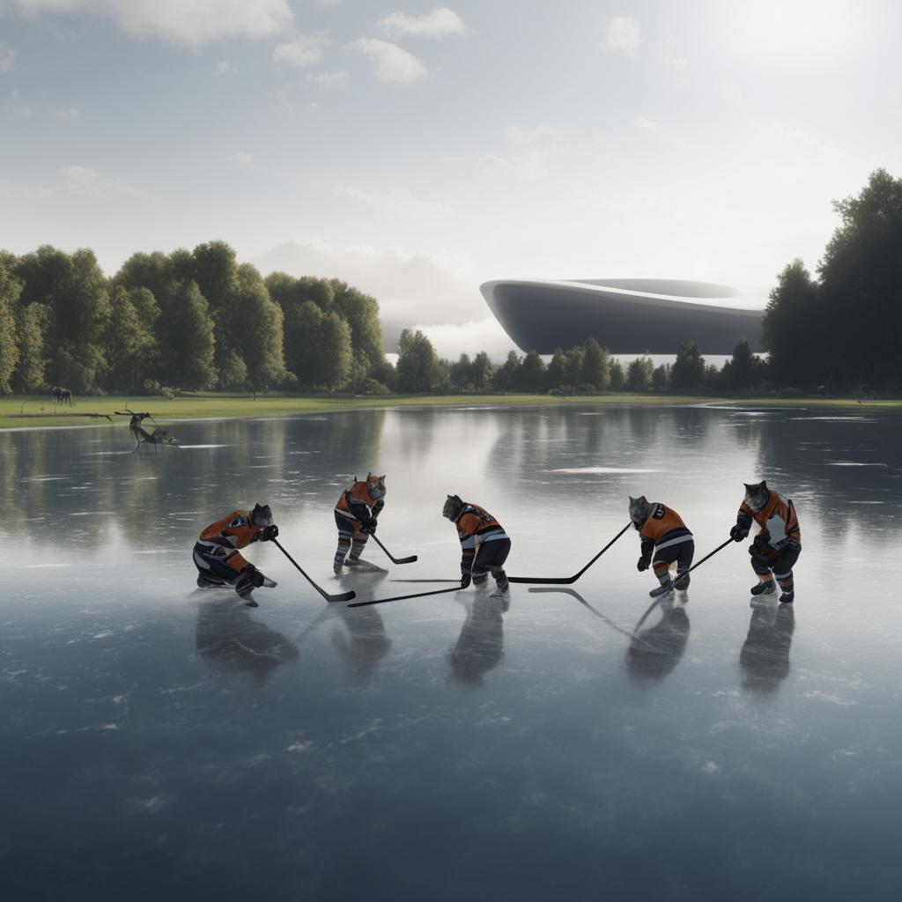
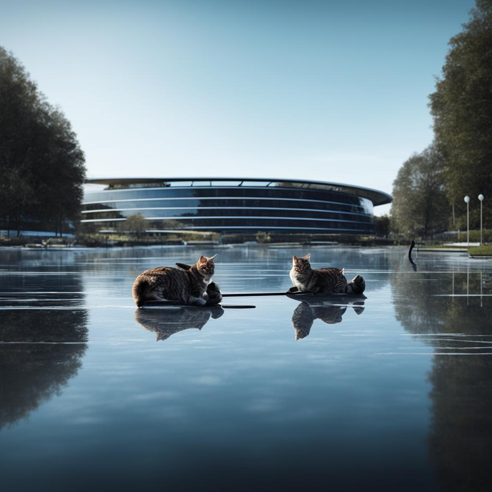
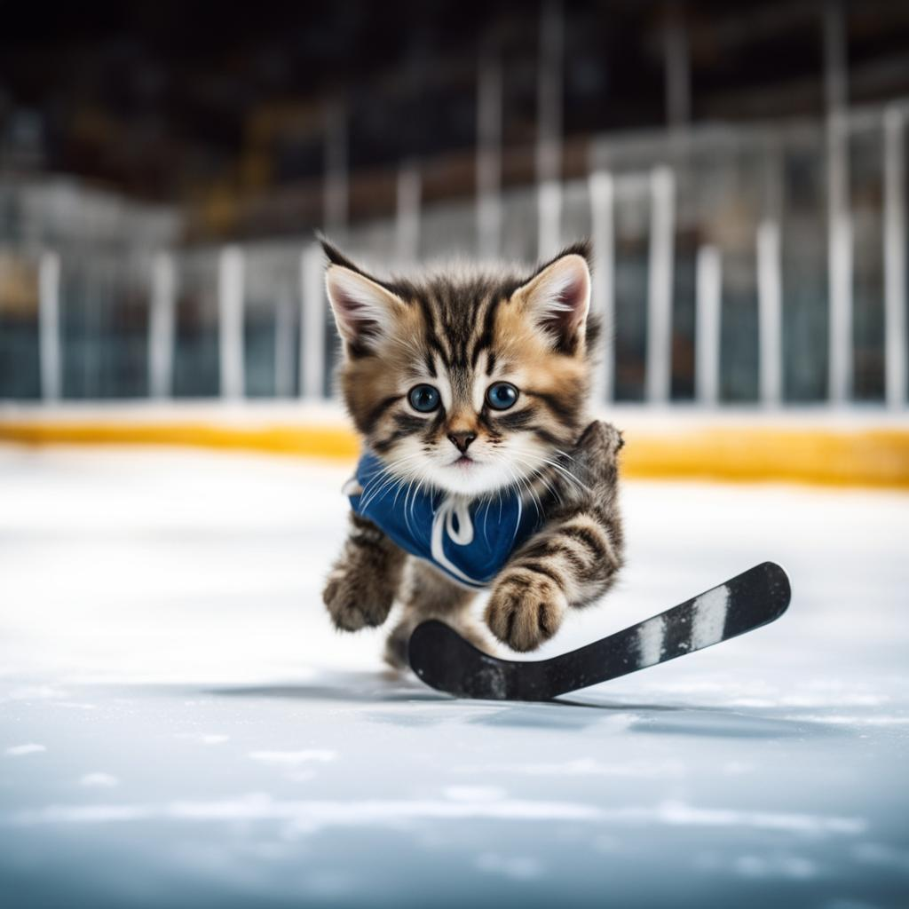

# О чемпионате
## САМОЕ ТЕПЛОЕ И ПУШИСТОЕ СПОРТИВНОЕ СОБЫТИЕ 2025 ГОДА

Кошачья хоккейная лига (КХЛ) – чемпионат с самыми милыми игроками. Коты-спортсмены играют в самый настоящий хоккей с шайбой на льду! Лига была утверждена 30.05.2025 в рамках программы по сокращению численности бездомных животных.

### Профессиональные спортсмены

Всего в чемпионате участвует 12 команд, разделенных на Западную и Восточную конференции. Спортсмены прошли отбор и ежедневно тренируются как в зале, так и на льду. Правила такие же, как в Континентальной хоккейной лиге с учетом адаптации под четвероногих.

### Сквозь океаны и горы летят наши котята

Кошачья хоккейная лига – международный чемпионат. 12 команд разделенны на Конференци Гринвича и Нового дня.

- **Конференция ГРИНВИЧА**
1. Санкт-Петербург
2. Череповец
3. Эспоо (Финляндия)
4. Ювяскюля (Финляндия)
5. Умео (Швеция)
6. Берн (Швейцария)  

- **Конференция НОВОГО ДНЯ**
1. Певек
2. Омск
3. Питтсбург (США)
4. Анкоридж (США)
5. Виннипег (Канада)
6. Квебек (Канада)

## ГДЕ СМОТРЕТЬ ВИСКАС КОНТИНЕНТАЛЬНАЯ ХОККЕЙНАЯ ЛИГА?
| Страна | Канал | Язык |
|:---------:|:-----:|:----------:|
| РФ | 12 КАНАЛ | Русский | 
| РФ | МАТЧ ТВ| Русский | 
| РФ | МАТЧ АРЕНА | Русский|
|РФ | МАТЧ СТРАНА| Русский |
|Финляндия|Urheilu+|Финский|
|Финляндия|MTV Urheilu	|Финский|
|Швеция|V Sport|Шведский|
|США|ESPN|Английский|
|США|Fox Sports|Английский|
|США|NBC Sports|Английский|
|США|CBS Sports|Английский|
|Канада|RDS|Французский|

> Они говорили, что лёд — для пингвинов. А мы сделали его своим домом.
> Они считали, что у бездомного котёнка нет будущего. А мы построили ему стадион.
>
> *— Калле Рованперя, основатель Кошачей хоккейной лиги*

|      |       |       |
|----------------------------|-----------------------------|-----------------------------|

