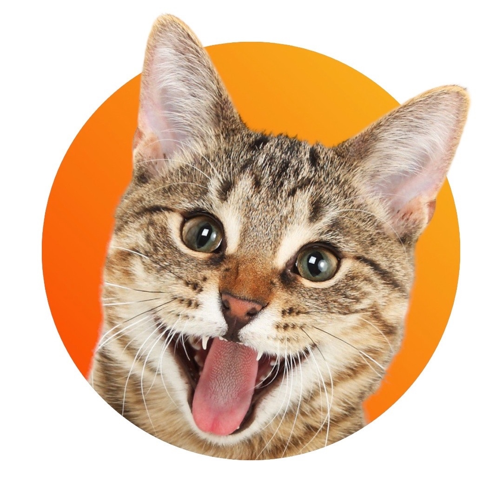
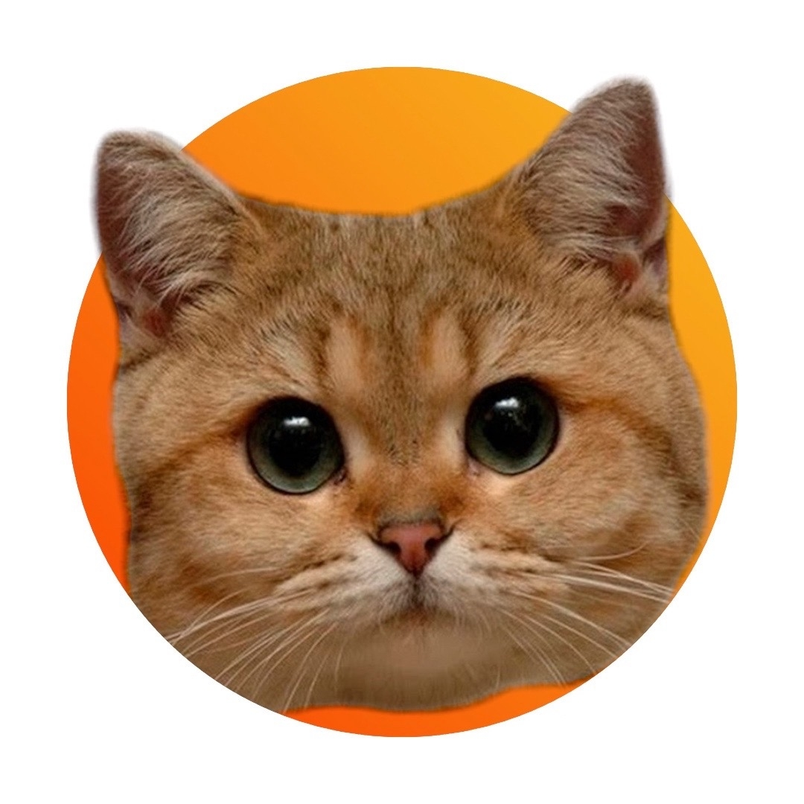
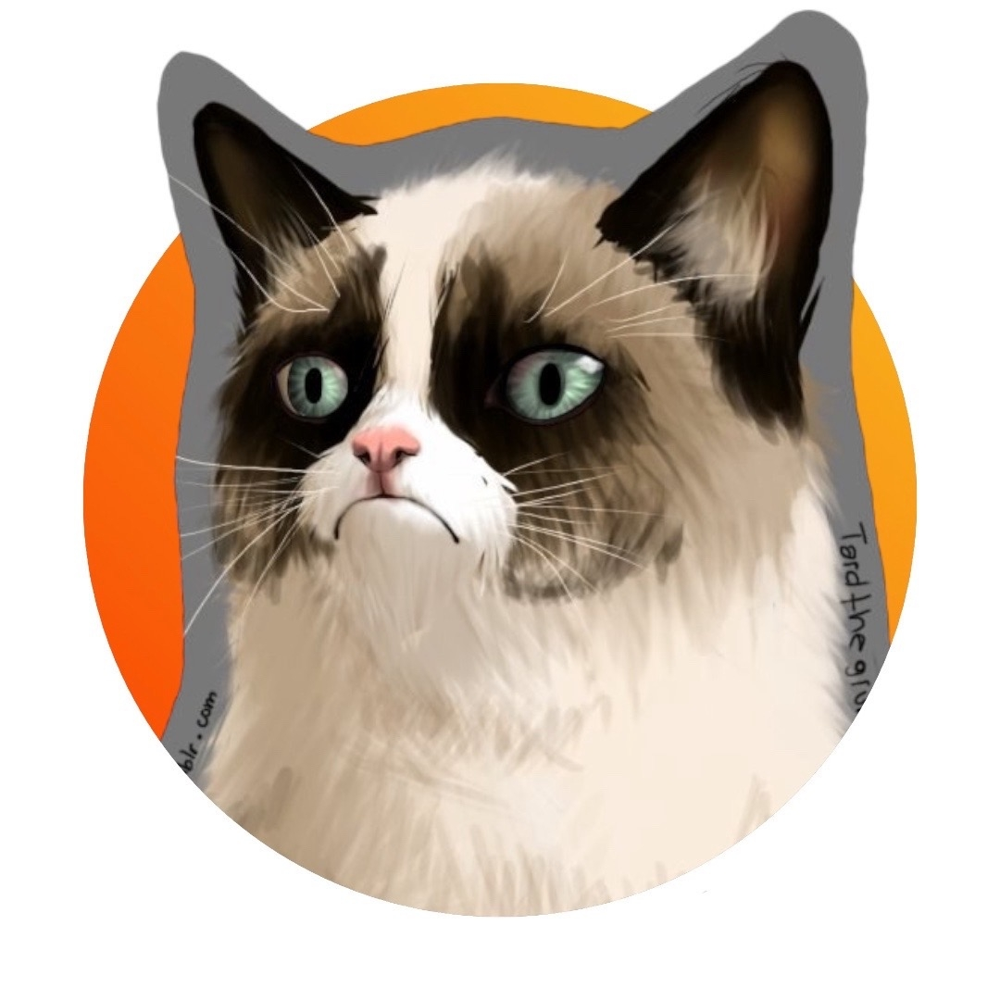

# ПРОШЕДШИЕ ИГРЫ
## 9 сентября
- G-Drive Арена, г. Омск  
- Омские Пироженки **11:1** Питтсбургские Мэнксы
 
*Игра стала богатой на заброшенные шайбы – из 12 всего одной удалось попасть в ворота американцев! Дамир ОстрыйКоготь совершил хет-трик, а между единственной шайбой Мэнков авторства Оскара Миастри и голом Джека Раселла прошло всего 5 секунд.*

---

## 12 сентября
- Kisapuisto, Лаппеенранта, Финляндия 
- Быстрые финики **4:3 ОТ** Снежные Корниш-рексы

*Сражение финнов и швейцарцев стало самым длинным матчем за всю историю КХЛ – 94 минуты. Итог матча определил гол в стиле лакросс в исполнении Мики Рикконена*

---

## 20 сентября
- G-Drive Арена, г. Омск  
- Омские Пироженки **7:2** Петербургские Солнышки  

*Первая встреча главных отечественных клубов сезона. Пироженки были в отличной форме, но Солнышки даже не думали сдаваться под натиском соперника. Внезапно вратари команд, в прошлом сокомандники, Тони Зеленый и Персик ДлинныйУс затеяли драку, за которую получили штрафы.*

---

|      |       |       |
|----------------------------|-----------------------------|-----------------------------|

